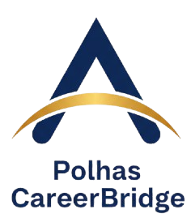

# 🎓 Polhas CareerBridge

Platform lengkap untuk mahasiswa Politeknik Hasnur: Skill roadmap interaktif, portfolio scorecard, dan lowongan magang dari Hasnur Group & mitra.



## 🚀 Fitur Utama

### 1. 🗺️ Skill Roadmap Interaktif
- 8 career paths (Web Dev, Mobile Dev, Data Science, dll)
- Skill tree dengan progress tracking
- Checklist skill yang bisa dicentang
- Rekomendasi learning resources

### 2. 📊 Portfolio Scorecard
- Evaluasi kesiapan portfolio & CV
- Scoring system 0-100
- Rekomendasi improvement
- Checklist komponen portfolio

### 3. 💼 Job Listings
- 47 lowongan magang & kerja
- Filter berdasarkan tipe & prodi
- Skill matching dengan lowongan
- Save & bookmark lowongan favorit
- Deep linking untuk share lowongan

### 4. 🏆 Gamification System
- Level & XP system
- Achievements & badges
- Progress tracking
- Leaderboard (coming soon)

### 5. 🎯 Smart Recommendation
- AI-powered job matching
- Berdasarkan prodi & skill
- Personalized suggestions

### 6. 📱 Fully Responsive
- Mobile-first design
- Hamburger menu
- Touch-optimized
- PWA-ready

## 🛠️ Tech Stack

- **Frontend**: HTML5, CSS3 (Tailwind CSS), JavaScript (ES6+)
- **Libraries**: 
  - SweetAlert2 (modals)
  - Toastify (notifications)
  - Particles.js (background effects)
  - AOS (scroll animations)
- **Architecture**: Component-based, modular JavaScript
- **Storage**: LocalStorage (auth & data persistence)

## 📁 Struktur Project

```
polhas-career-bridge/
├── assets/
│   └── img/                    # Images & logos
├── components/
│   ├── navbar.html            # Responsive navbar with mobile menu
│   ├── footer.html            # Footer component
│   └── auth-modal.html        # Login/Register modal
├── css/
│   └── style.css              # Custom styles & responsive design
├── js/
│   ├── auth.js                # Authentication system
│   ├── components.js          # Component loader
│   ├── data.js                # Jobs & roadmap data
│   ├── gamification.js        # Gamification system
│   ├── main.js                # Main application logic
│   ├── particles-config.js    # Particles configuration
│   ├── partners.js            # Partners data
│   ├── recommendation.js      # Job recommendation engine
│   └── ui.js                  # UI utilities
├── index.html                 # Homepage
├── jobs.html                  # Job listings page
├── saved-jobs.html            # Saved jobs page
├── roadmap.html               # Skill roadmap page
├── portfolio.html             # Portfolio scorecard page
├── dashboard.html             # User dashboard
├── about.html                 # About page
├── PITCHING_NARASI.md         # Pitching narrative
└── README.md                  # This file
```

## 🚀 Quick Start

### Prerequisites
- Modern web browser (Chrome, Firefox, Safari, Edge)
- Local web server (optional, for development)

### Installation

1. Clone repository:
```bash
git clone https://github.com/AkbariAidul/polhas-career-bridge.git
cd polhas-career-bridge
```

2. Open dengan live server atau langsung buka `index.html` di browser

### Development

Untuk development, gunakan live server:
```bash
# Jika menggunakan VS Code
# Install extension "Live Server"
# Klik kanan index.html > Open with Live Server

# Atau gunakan Python
python -m http.server 8000

# Atau gunakan Node.js
npx serve
```

## 📱 Fitur Responsive

Website ini fully responsive dengan breakpoints:
- **Mobile**: < 768px (1 column layout)
- **Tablet**: 768px - 1024px (2 column layout)
- **Desktop**: > 1024px (4 column layout)

Fitur mobile:
- Hamburger menu
- Touch-optimized buttons (min 44px)
- Reduced animations
- Optimized particles
- iOS Safari fixes

## 🎨 Design System

### Colors
- **Primary**: Blue (#3b82f6)
- **Secondary**: Purple (#8b5cf6)
- **Accent**: Pink (#ec4899)
- **Success**: Green (#10b981)
- **Warning**: Orange (#f59e0b)
- **Error**: Red (#ef4444)

### Typography
- **Font**: Plus Jakarta Sans
- **Headings**: Bold, gradient text
- **Body**: Regular, gray-900

### Components
- Glassmorphism effects
- Rounded corners (rounded-3xl)
- Gradient backgrounds
- Smooth animations
- Shadow effects

## 🔐 Authentication

Simple authentication system menggunakan LocalStorage:
- Register dengan nama, email, password, prodi
- Login dengan email & password
- Profile management
- Avatar generation
- Session persistence

**Note**: Ini adalah demo authentication. Untuk production, gunakan backend authentication yang proper.

## 📊 Data Structure

### Jobs
```javascript
{
  id: 1,
  role: "Frontend Developer",
  company: "PT Hasnur Jaya Utama",
  type: "Magang",
  location: "Banjarmasin",
  prodi: ["Teknik Informatika"],
  description: "...",
  requirements: [...],
  requiredSkills: [
    {
      role: "web-dev",
      level: 1,
      skills: ["HTML", "CSS", "JavaScript"]
    }
  ]
}
```

### Skill Roadmaps
```javascript
{
  "web-dev": {
    title: "Web Development",
    description: "...",
    levels: [
      {
        level: 1,
        title: "Beginner",
        skills: [
          {
            name: "HTML",
            description: "...",
            resources: [...]
          }
        ]
      }
    ]
  }
}
```

## 🤝 Contributing

Contributions are welcome! Please follow these steps:

1. Fork the repository
2. Create feature branch (`git checkout -b feature/AmazingFeature`)
3. Commit changes (`git commit -m 'Add some AmazingFeature'`)
4. Push to branch (`git push origin feature/AmazingFeature`)
5. Open Pull Request

## 📝 License

This project is licensed under the MIT License.

## 👥 Team

- **Developer**: Akbari Aidul
- **Institution**: Politeknik Hasnur
- **Contact**: akbariaidul@gmail.com

## 🙏 Acknowledgments

- Politeknik Hasnur
- Hasnur Group
- All contributors and supporters

## 📞 Support

Untuk pertanyaan atau dukungan:
- Email: akbariaidul@gmail.com
- GitHub Issues: [Create an issue](https://github.com/AkbariAidul/polhas-career-bridge/issues)

---

Made with ❤️ by Politeknik Hasnur Students
